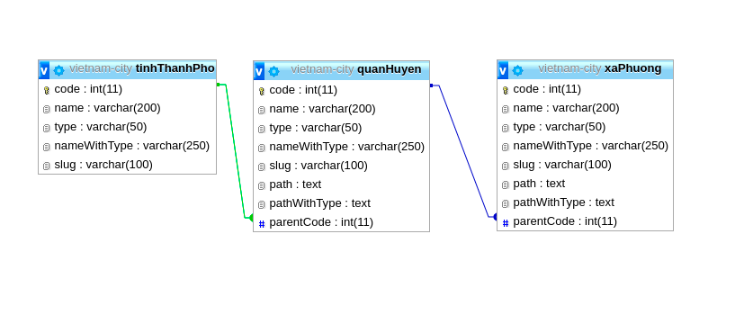

# Provinces of Vietnam

# Getting started
- Clone the repository
```
git clone --depth=1 https://github.com/nmtrangg99/Vietnam-Data-City.git <project_name>
```
- Install dependencies
```
cd <project_name>
npm install
```
- Create database ``vietnam-city``




Typing in your url: localhost:3000/


- Insert into database 
```
GET: /insert
```
- Insert only quanHuyen
```
GET: /insert-quan-huyen
```
